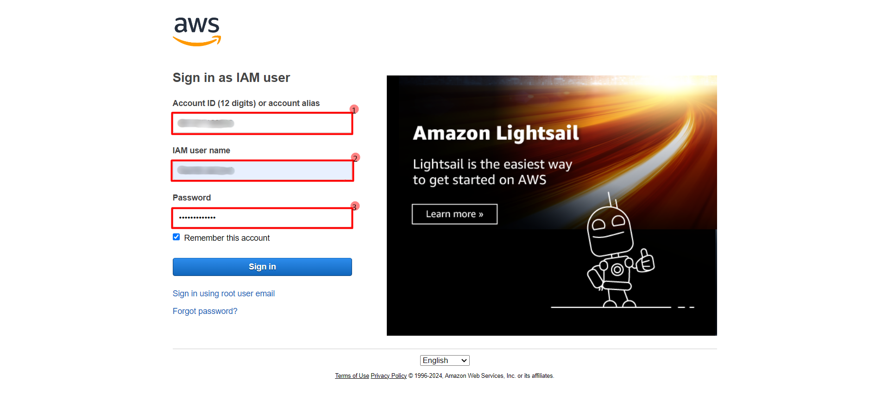
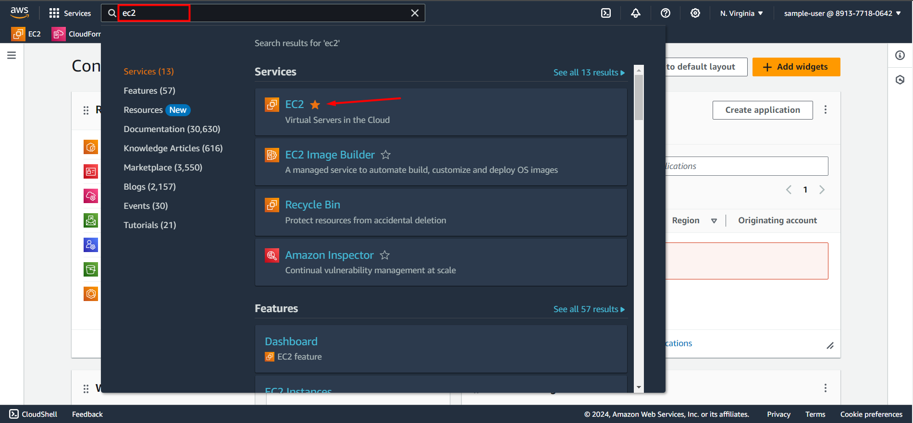
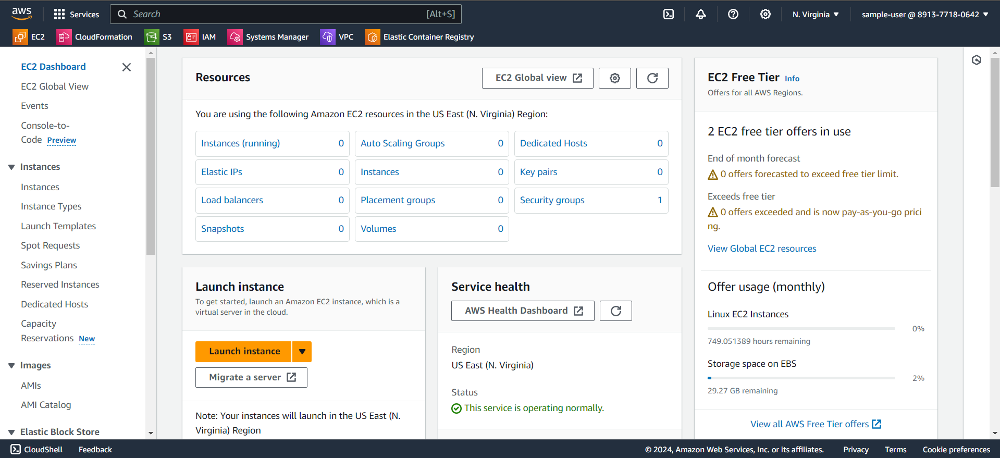

<h1 align="middle"> Login to AWS account</h1> 

1. Sign in to the AWS Management Console by providing account id, user name and password. 
> Your admin will provide sign-in link which will by default have account id in it.

2. Search for EC2 in the search bar and select the first option.

3. The EC2 dashboard is displayed and monitoring the EC2 resources can be done from here. 

