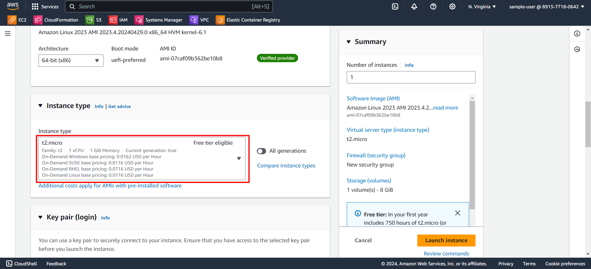

<h1 align="middle"> Getting Started with EC2 </h1>

---

### Launching your first EC2 instance

1. Click on **Launch instance** or you can go the the **instances** in the left panel and then click on **Launch instance**.

2. Provide a name for your EC2 instance. 

3. Select an Amazon Machine Image (ami) of your choice and preference.
  
{#section-1} 

4. Select an instance type that meets your computing, memory, networking, or storage needs.

5. In the Key pair login section, you need to create new key pair. Select **Create new key pair** option. 

6. Provide a name for key pair which should be unique everytime. Then, click on **Create key pair** which will create a new key pair.

> When the key pair is created, a file with private key file format (.pem or .ppk) is downloaded to your system. Use that key to access your instance when logging in through ssh client.

7. Keep the Network Settings as it is.

> **NOTE:** Default network which is present in every region, will be selected if no settings is done.

8. Specify the storage type to use in the instance based on your preference.

9. After selecting your preferences, click on Launch instance which will create your instance.

