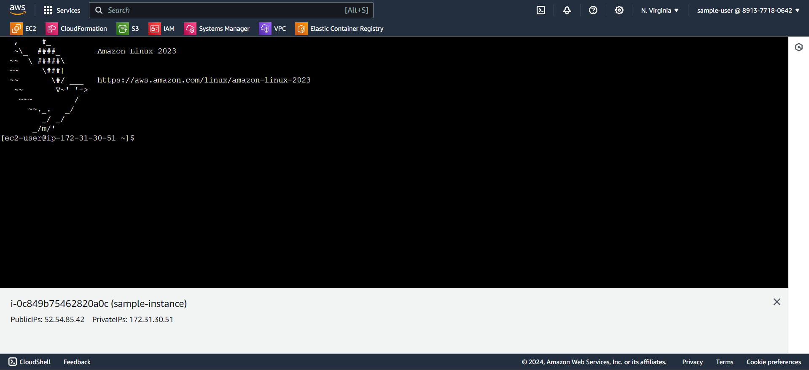

### Connecting to your EC2 instance

1. After creating your ec2 instance, you can see the status of the instance.

2. To check the list of Ec2 instances which are deployed, go to the **instances** in the left panel.

3. You can see that the Ec2 instance in the **running state**. Now click on the **instance id** 

4. Ec2 instance summary will be opened. Click on the **connect** button.

5. Navigate down the **Connect to instance** page and click on **connect** button.  

6. You can perform your tasks in this ec2 instance command line interface(cli). 

> The ami id selected for this instance is amazon linux. You can choose your type of os.

