<h1 align="middle"> Managing EC2 instance </h1>

---

## Managing instances

Instance have different states which are explained below -
    <ol>
    <li type="i">When the new instance is launched, the instance state enter <b>pending state,</b> which means that instance is preparing to enter running state.
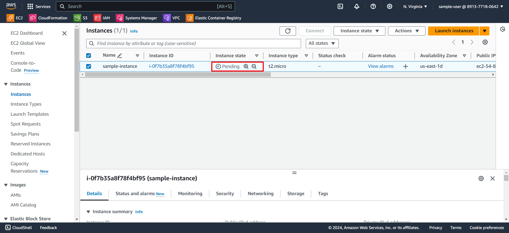
    </li>
    <li type="i">If the instance state is in <b>Running state,</b> then it is ready for use. Also <b>Status check</b> will show <b>initializing</b> state which means that automated checks are running.

!!! NOTE: A status check gives you the information that results from automated checks performed by Amazon EC2. For more information, check this [link.](https://docs.aws.amazon.com/AWSEC2/latest/UserGuide/monitoring-instances-status-check.html)

    </li>
    <li type="i"> After some time, the Status check will finish the checking and display <b>2/2 check passed.</b> If it shows any error shows up here, then there exists some problem in instance while creating.

    </li>
    <li type="i"> The instance have different status (which are listed below) other than pending and running state. To know more about this states, you can check [here.](https://docs.aws.amazon.com/AWSEC2/latest/UserGuide/ec2-instance-lifecycle.html)
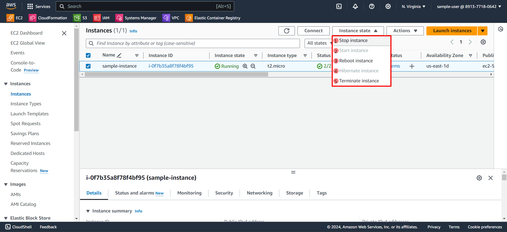    
    </li>
    </ol>

There is another set of options present in instance which are **actions** which are useful for more control and monitor on your instances. Each one of them listed, provide different kind of monitor and control access on your instances. The first 3 options is explained in the previous section.

<ol>

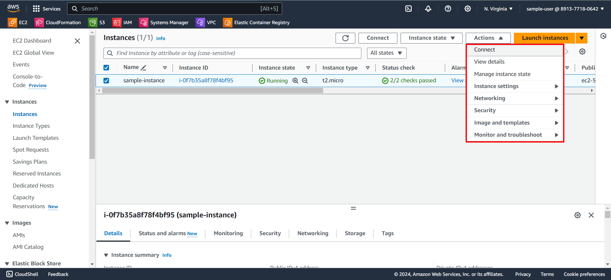
<li type="i"> The 4th option in actions list is <b>instance settings,</b>
 which provide control on instance related settings.

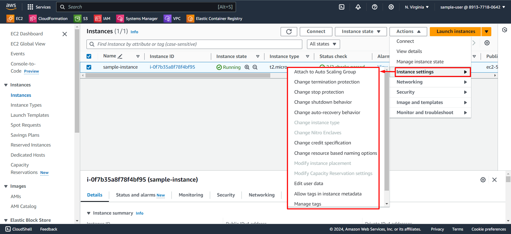
</li> 
<li type="i"> The 5th option in actions list is <b>Networking,</b> which provide control on network related settings.

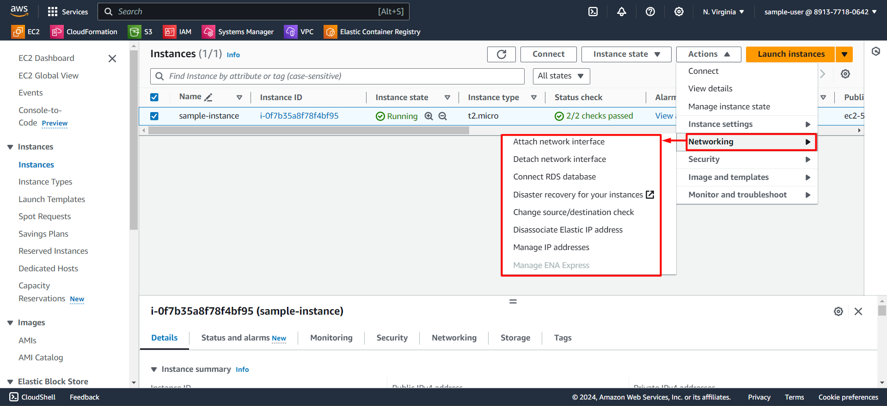
</li> 

<li type="i"> The 6th option in action list is <b>Security,</b> which provide control on security related settings.

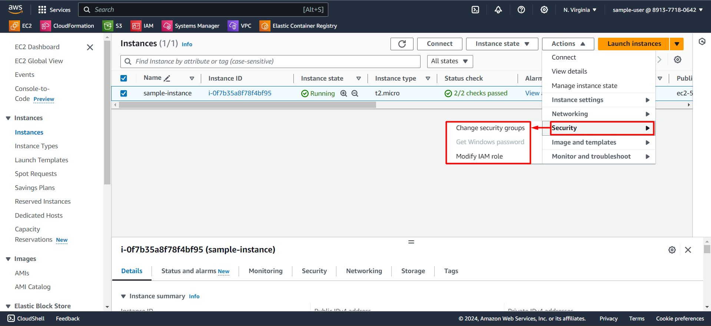
</li> 

<li type="i"> The 7th option in action list is <b>Image and templates,</b> which provide options to create images and templates of the selected instance.

</li> 

<li type="i"> The 8th option in action list is <b>Monitor and troubleshoot,</b> which provide monitoring and troubleshooting help.

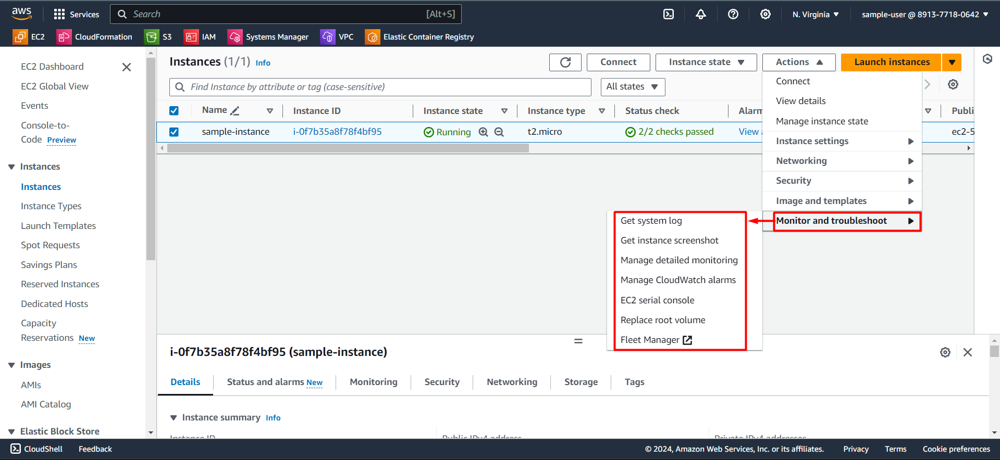
</li> 
</ol>

As you have learnt in previous section to connect to your instance through [summary console](#section-2), now navigate down the console and you will get all the settings and resources associated to your instance. 
 

Each of the listed options in the image shown below provide some information which are related to your instance.  

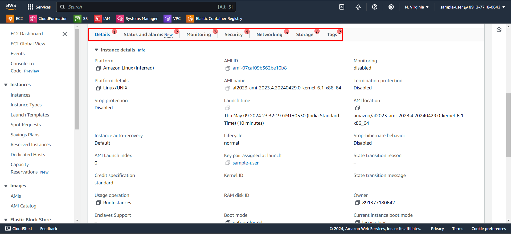

The left panel is useful when 
1.  you want to rent your instances.
2.  make request to keep your instances for a period of time.
3.  capacity reservations.
4.  managing ami.
5.  managing **ebs volume** (elastic block storage) 
6.  managing network and security group.
7.  managing load balancer and auto scaling groups.

Try to explore all the options where you can customise your instance based on your use-case.
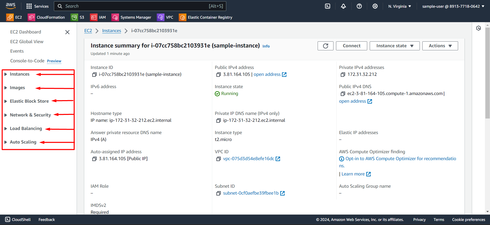

!!! - To track all the EC2 instance deployed in different regions, go to [EC2 Global View](#section-3) where you can view all your resources at one page.

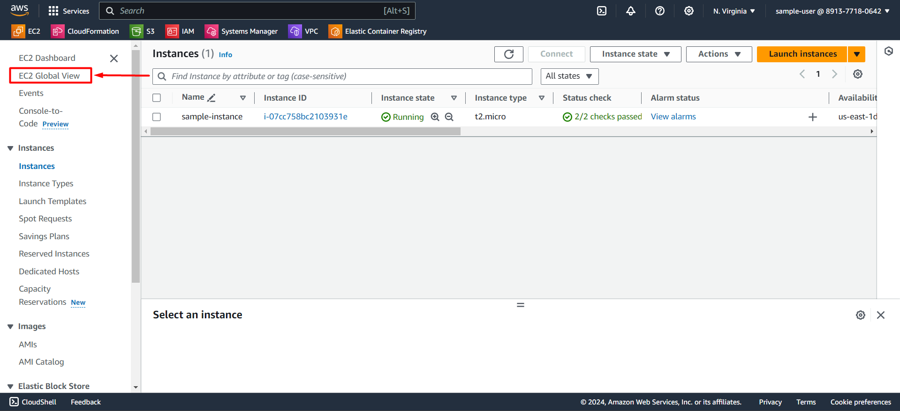
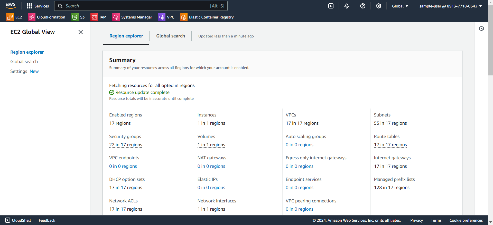{#section-3}