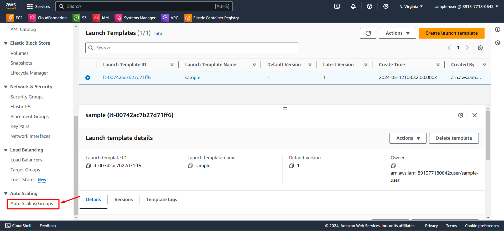
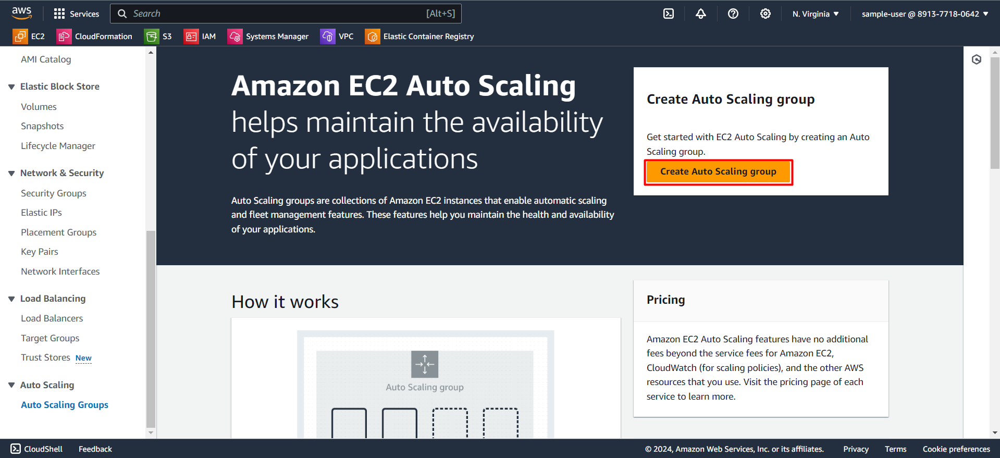
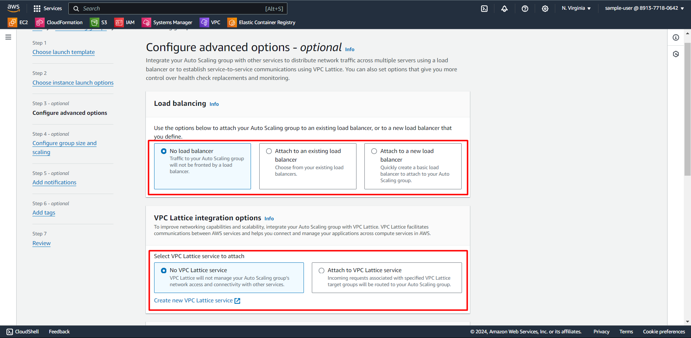
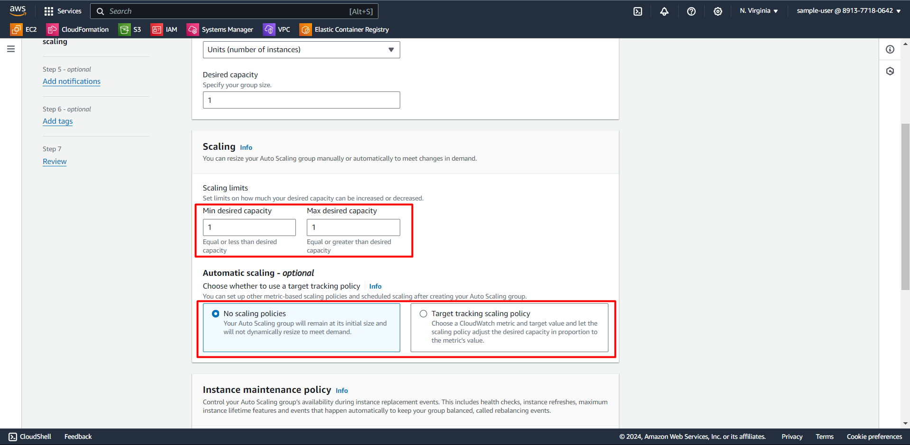

## Scaling Your EC2 Infrastructure

---

#### Overview of auto-scaling groups

Amazon EC2 Auto Scaling helps you manage the number of EC2 instances needed for your application. You create groups of EC2 instances called Auto Scaling groups. You set rules for these groups like the minimum and maximum number of instances. You can also specify how many instances you want at any given time. With scaling policies, EC2 Auto Scaling can automatically add or remove instances based on the demand for your application.

For more information, refer this [link.](https://docs.aws.amazon.com/en_us/autoscaling/ec2/userguide/what-is-amazon-ec2-auto-scaling.html)

#### Creating and configuring auto-scaling groups

Before creating auto-scaling group, there should be a launch template created to automate instance launches, simplify permission policies, and enforce best practices across your organization. 

Follow the below steps to create a launch template and create a auto-scale group.

1. In the left panel, search for **Launch template** and click on it.

2. Now, click on **Create Launch template**.

3. Provide a name for the template, a short description, followed by optional guidence to setup the EC2 auto scaling.

4. Choose an OS image of your choice.

5. Choose an instance type based on your use-case.

6. If you want to use a keypair for secure shell(ssh) or remote desktop protocol(rdp) connection, you can use an existing keypair or create a new keypair. In the below step, keypair is not provided.

7. In Network settings, including subnet is an optional setting. A security group should be selected or should create a new security group and attach to the template. Here, the default security group is selected. 

8. An EBS(Elastic Block Storage) volume should be mentioned which is a mandatory field. Here, EBS storage of 8 gb volume and gp3 type is selected.

9. Adding resource tags and Advanced details which is further customisation are optional settings. After completing all the previous steps, click on **create launch template.**

10. A launch template will be created with all the details mentioned in the below console. Here, we named *sample* as our first launch template.

11. In the left panel, navigate down and search for **Auto Scaling Groups** and click on it.

12. The below image is the welcome page of the Auto scaling group. Click on **Create Auto Scaling group.**

13. Provide a name for the Auto scaling group. Then, select the launch template that was created as shown in previous steps. Here, we select launch template with name *sample*.

14. Select minimum and maximum limit for both CPUs and Memory as per your usecase. If you don't want any limits, click on the below checkbox provided in each field. 

15. Add instance attributes to further limit which instance types may be used to fulfill your desired capacity (optional).
In the **Instance purchase option**, to save money on your application, use a mix of On-Demand and Spot Instances. Spot Instances are cheaper but might be interrupted. They're great for flexible workloads that can handle interruptions and run on different instance types.
First, decide how many instances you need as On-Demand Instances for your basic capacity. Then, for additional instances beyond that, specify the percentages of On-Demand and Spot Instances. For instance, if you need a total of 25 instances with a base of 10, and you set the Spot percentage to 100%, Amazon EC2 Auto Scaling will launch 10 On-Demand Instances and 15 Spot Instances.

16. **Allocation strategies** determine how your Spot and On-Demand capacity are launched using the instance types available in a specific Availability Zone. 
Choose the Amazon **Virtual Private Cloud (VPC)** network you want to use for your Auto Scaling group. You can use the *default VPC* or a customised VPC.
Then, choose a **subnet** in each Availability Zone where your instances will run. An Auto Scaling group cannot span Regions.

17. If you host an application on multiple Amazon EC2 instances, you can distribute traffic to your application across the instances by attaching an **Elastic Load Balancing load balancer.**
You can use Amazon **VPC Lattice** to manage the flow of traffic and API calls between your applications and services that run on separate AWS resources.

18. **Health checks** increase availability by replacing unhealthy instances. When you use multiple health checks, all are evaluated, and if at least one fails, instance replacement occurs. Set your desired time period for the health check to run in the **Health check grace period.**

19. **Monitoring** : Choose whether to turn on metrics collection for the different metrics that your Auto Scaling group can track.
**Default instance warmup** : The amount of time that CloudWatch metrics for new instances do not contribute to the group's aggregated instance metrics, as their usage data is not reliable yet.

20. Choose a value for Desired capacity to represent the initial group size. If you need to change the size of the group, you can change the desired capacity later.

21. To use a target tracking scaling policy, edit the values for **Min desired capacity** and **Max desired capacity** to specify the range that is allowed. Scaling policies cannot go higher or lower than the minimum-maximum range.
**Automatic scaling** : You can set up other metric-based scaling policies and scheduled scaling after creating your Auto Scaling group. 

22. Control your Auto Scaling group’s availability during instance replacement events. This includes health checks, instance refreshes, maximum instance lifetime features and events that happen automatically to keep your group balanced, called rebalancing events.
**Instance scale-in protection**: Scale-in protection prevents newly launched instances from being terminated by scaling activities. Make sure to remove scale-in protection for the group or individual instances when instances are ready to be terminated.

23. Send notifications to SNS topics whenever Amazon EC2 Auto Scaling launches or terminates the EC2 instances in your Auto Scaling group. 
(This is an optional setting, can skip this if not necessary)

24. Add tags to help you search, filter, and track your Auto Scaling group across AWS. You can also choose to automatically add these tags to instances when they are launched. 
(This is an optional setting, can skip this if not necessary)

25. Verify your settings for your Auto Scaling group, and edit the settings as needed. When you are satisfied with your settings, choose Create Auto Scaling group.

