<h1 align="middle"> Monitoring EC2 Instances</h1>

---
Monitoring EC2 instances involves keeping an eye on the performance, health, and usage of your Amazon EC2 virtual servers. It's like regularly checking how well your computer is running. With monitoring, you can track things like CPU usage, memory usage, disk space, and network traffic to make sure everything is running smoothly. This helps you identify any issues or bottlenecks early on, so you can take action before they become bigger problems. Monitoring EC2 instances is essential for maintaining the reliability and performance of your applications hosted on the cloud.

Below are some of the monitoring types which can be used to track ec2 instances -  

1. **Using CloudWatch to monitor EC2 instances**: CloudWatch is like a watchdog for your EC2 instances, keeping an eye on their performance and health. It collects data on things like CPU usage, disk space, and network traffic, giving you insights into how your instances are doing. With CloudWatch, you can see if there are any issues that need attention, helping you keep your applications running smoothly.
Steps to use CloudWatch :
    <ol>
    <li type="i"> In the search box, type <b>CloudWatch</b> and select first option as shown.

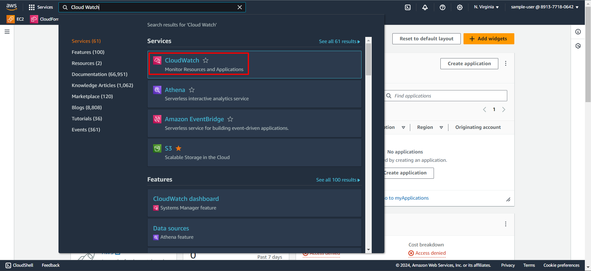     
    </li>
    <li type="i"> The CloudWatch dashboard will be opened. In the left panel, search for **EC2 Resource Health** and click on it.

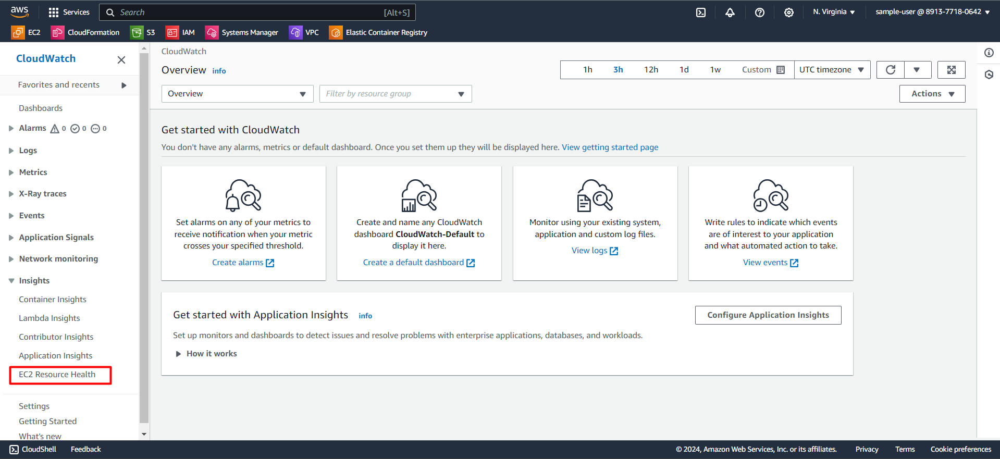    
    </li>
    <li type="i"> CloudWatch Resource Health enables you to automatically discover, manage, and visualize the health and performance of EC2 hosts across your applications in a single view. Now click on *List View*.

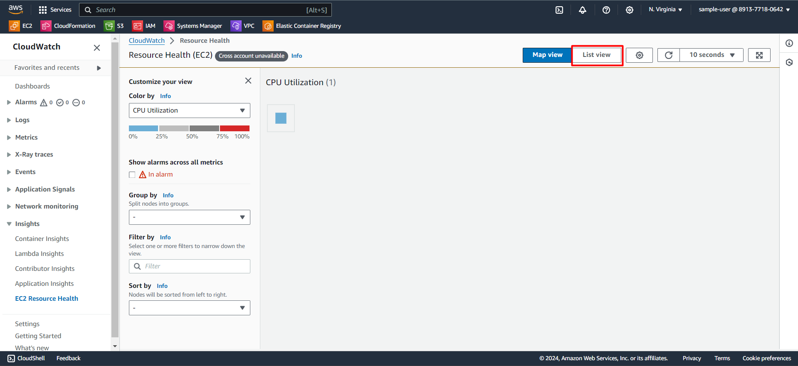    
    </li>
    <li type="i">The previously created EC2 instance will be displayed here. Click on the *instance id*.

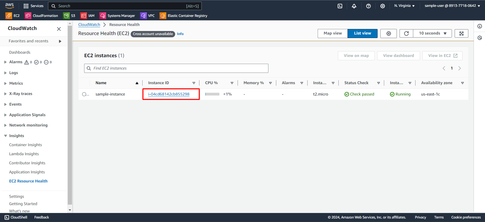    
    </li>
    <li type="i"> Resource Health visualizations based on performance dimensions such as CPU Utilization, Memory Utilization, or Status Check will be displayed here. You can also slice and dice hundreds of EC2 hosts using available filter options.

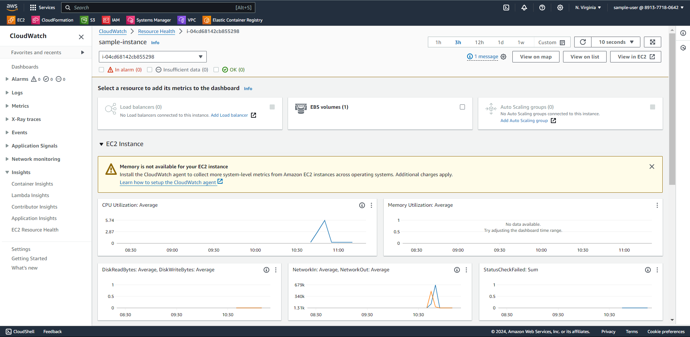    
    </li>
    </ol>

2. **Setting up custom CloudWatch metrics**: Sometimes, the standard metrics that CloudWatch provides might not be enough for your specific needs. That's where custom metrics come in. You can set up custom metrics to track things that are important to your application, like the number of users logged in or the response time of a particular service. This gives you even more visibility into how your application is performing.
    Steps to create CloudWatch metrics :
     
    <ol>
    <li type="i"> Open CloudWatch Dashboard, click on <b>Create Dashboard</b> option button.

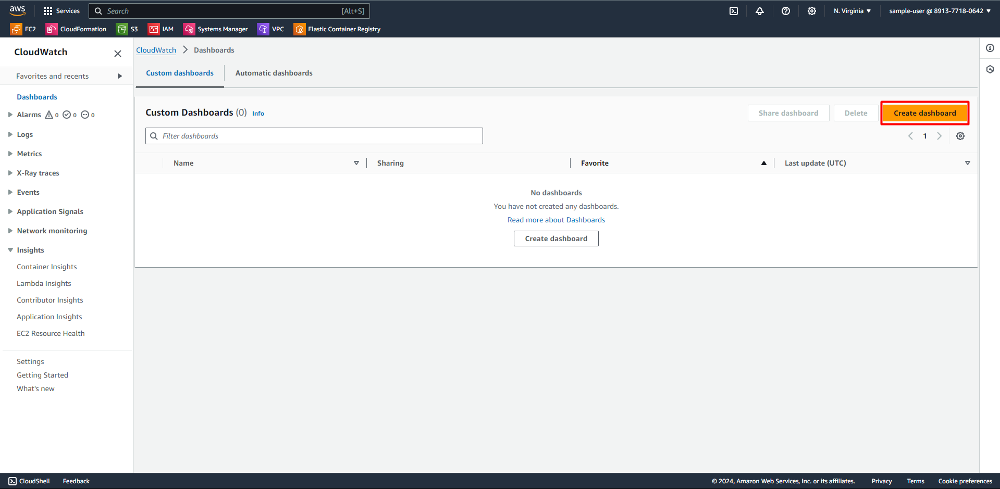    
    </li>
    <li type="i"> Provide a name for the dashboard related to your usecase. Here we are providing <i>ec2-monitor</i> as name to monitor instance created in previous steps.

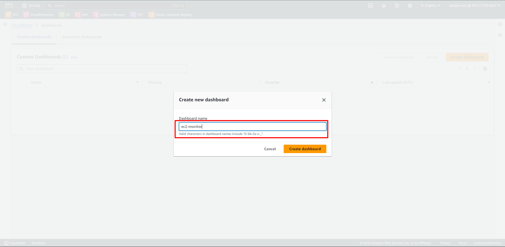    
    </li>
    <li type="i"> Select an appropriate widget visualization type of your preference.

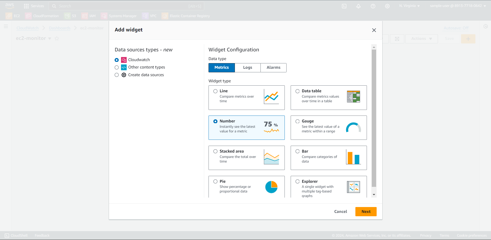    
    </li>
    <li type="i"> In this step, metric graph will be shown based on the resource you select. 

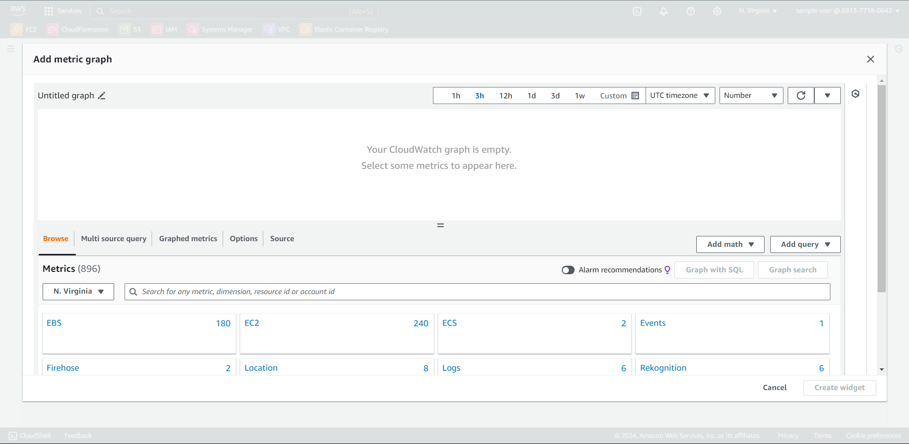    
    </li>
    <li type="i"> In this step, we have provided the instance-id of the instance created in previous step. Then, the console shows 17 different metrics. Click on it and select whichever is required.

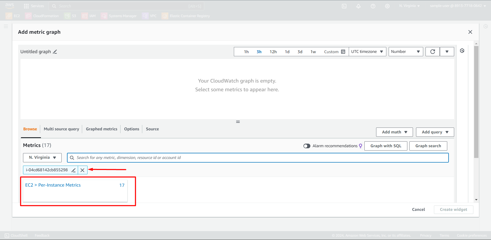    
    </li>            
    <li type="i"> Here, we have selected all 17 metrics to monitor dashboard. Then, click on <b>Create widget.</b>

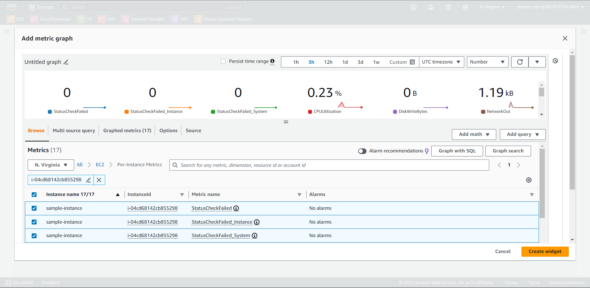    
    </li>
    <li type="i"> The monitoring dashboard is created. You can monitor with customizable update time period as highlighted. Then click on <b>save</b> to save the dashboard. 

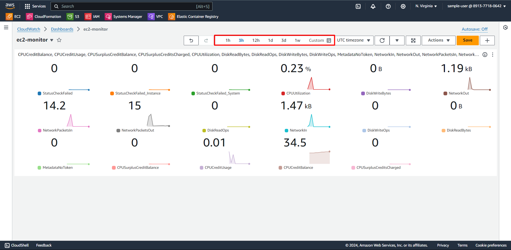    
    </li>
    </ol>

<b>Congratulations!</b> You have successfully completed this lab guide for creating, maintaining and monitoring EC2 instances.
